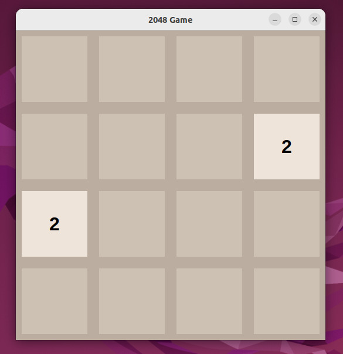
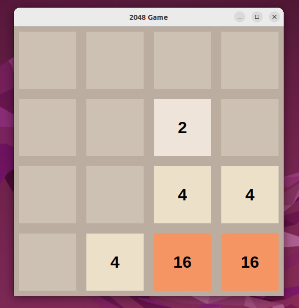

<div align="center">

# 🎮 2048 Game in Python

A classic 2048 sliding block puzzle game built from scratch in Python using **Tkinter** for graphical interface and game animations.

<!-- Badges -->


<br/><br/>

<!-- Screenshot Preview -->


</div>

---

## 📌 Overview

This project is a desktop recreation of the popular single-player sliding block puzzle game **2048**. The objective is to slide numbered tiles on a 4×4 grid using arrow keys, combining matching tiles to create a tile with the number **2048** (and beyond).

---

## ✨ Features

* 🎯 **Classic 4x4 Grid:** Authentic tile color palette matching original values.
* ⌨️ **Keyboard Controls:** Play smoothly with standard arrow keys.
* 🔢 **Tile Merging Logic:** Full row/column compression, merging, and real-time score calculation.
* 🎲 **Random Tile Spawner:** Automatically spawns `2` or `4` after each valid move.
* ⚡ **Zero Dependencies:** Runs natively with Python standard libraries (`tkinter`, `random`).

---

## 🛠️ Tech Stack

* **Language:** Python 3
* **GUI Framework:** Tkinter (Standard GUI toolkit)
* **Logic:** Matrix transformation & manipulation

---

## 🚀 How to Run Locally

### 1. Clone the repository
```bash
git clone [https://github.com/KNakshitha/2048-AI-Project-.git](https://github.com/KNakshitha/2048-AI-Project-.git)
cd 2048-AI-Project-

2. Run the game
  python3 2048.py

🕹️ Controls
   Key              Action
⬆️ Up        ArrowSlide all tiles Up
⬇️ Down      ArrowSlide all tiles Down
⬅️ Left      ArrowSlide all tiles Left
➡️ Right     ArrowSlide all tiles Right


<div align="center">




</div>
