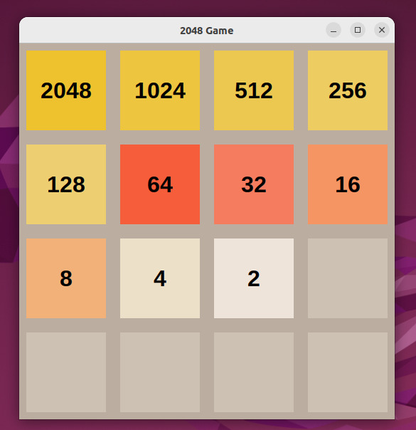

<div align="center">

# 🎮 2048 Game in Python

A classic 2048 sliding block puzzle game built from scratch in Python using **Tkinter** for graphical user interface and animation.

<!-- Badges -->


</div>

---

## 📌 Overview

This project is a desktop recreation of the popular single-player sliding block puzzle game **2048**. The objective is to slide numbered tiles on a 4×4 grid using arrow keys, combining matching tiles to reach the **2048** tile!

---

## ✨ Features

* 🎯 **Classic 4x4 Grid:** Smooth UI with authentic tile colors.
* ⌨️ **Keyboard Controls:** Move smoothly in all 4 directions.
* 🔢 **Tile Merging Logic:** Full matrix compression, merging, and score tracking.
* 🎲 **Random Tile Spawner:** Automatically spawns `2` or `4` after each valid move.
* ⚡ **Zero External Dependencies:** Built purely with Python standard libraries (`tkinter`, `random`).

---

## 🛠️ Tech Stack

* **Language:** Python 3
* **GUI Toolkit:** Tkinter

---

## 🚀 How to Run Locally

### 1. Clone the repository
```bash
git clone [https://github.com/KNakshitha/2048-AI-Project-.git](https://github.com/KNakshitha/2048-AI-Project-.git)
cd 2048-AI-Project-
```

2.Run the script 
  python3 2048.py

🕹️ Controls
​<kbd>▲ Up Arrow</kbd>  —  Slide tiles Up
​<kbd>▼ Down Arrow</kbd>  —  Slide tiles Down
​<kbd>◄ Left Arrow</kbd>  —  Slide tiles Left
​<kbd>► Right Arrow</kbd>  —  Slide tiles Right


​📸 Final Output


